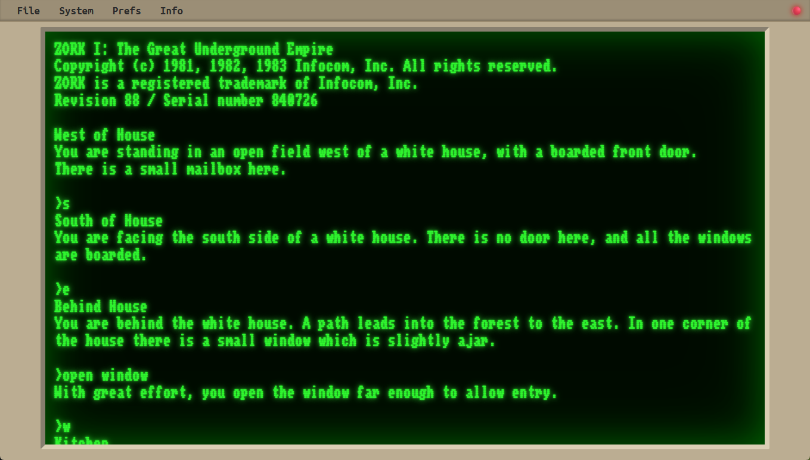

# GOZM – Go Z-Machine Runtime & Engine

GOZM is a Z-Machine interpreter written in Go that runs classic text adventure games from the Infocom era. It focuses on Z-Machine version 3 and executes real games end-to-end—including bundled Infocom titles and custom Inform 6 stories—both in the terminal and directly in the browser via WebAssembly. The codebase is designed to be readable and educational, making it accessible for anyone interested in understanding the architecture of Infocom's original virtual machine.

## Current Status

- Full compatibility with any game that targets Z-Machine version 3, including Infocom titles like Zork I, II, III, and freeware games compiled with Inform 6.
- Web frontend with retro terminal-style UI for immersive text adventure gameplay.
- Plain-text terminal runner for local play and debugging.
- Command-line debug levels (`-debug 0|1|2`) expose instruction tracing and state dumps to aid reverse engineering and spec validation.
- Save/Load functionality for all games and browser localStorage integration.



## Try the Live Web Version

A live deployment of the web version is available at **https://gozm.benc.dev/** where you can play Z-machine games directly in your browser without any installation. Simply select a story from the menu and start playing classic text adventures with a retro terminal interface.

## Features

- Z-Machine v3 focused interpreter core with structured call stack and object model support.
- Story loader that validates headers, decodes packed addresses, and hydrates initial game memory from Z3 files.
- Text decoding (ZSCII, abbreviations, dictionary lookup)
- Terminal UI providing synchronous input and display, suitable for playing stories directly in the shell.
- **Save/Load support** – Persistent game state with save files, plus browser localStorage integration for the web version.
- **System commands** – Special `/` prefixed commands for save, load, restart, and quit operations.

## Project Layout

- `internal/zmachine/` – machine runtime: instruction dispatch, call stack, object tree, I/O hooks.
- `internal/decode/` – helpers for unpacking V3 headers, operands, and text (abbreviations, ZSCII tables).
- `impl/terminal/` – CLI runner that wires stdin/stdout to the interpreter.
- `impl/web/` – WASM entry point for running Z-machine games in the browser with a retro terminal UI.
- `web/` – HTML, CSS, and JavaScript frontend for the WASM build, including story file selection menu.
- [`docs/spec/`](docs/spec/README.md) & [`docs/guide/`](docs/guide/part-01.md) – annotated spec excerpts and a tutorial series documenting implementation details.

## Getting Started

### Prerequisites

- Go 1.25 or newer.
- (Optional) Inform 6 compiler and UnZ tooling if you want to build the sample `.inf` sources yourself.

### Build the CLI Runner

```bash
make build
```

### Run a Story

```bash
./bin/gozm -file web/stories/minizork.z3
```

Add `-debug 1` for single-step logging or `-debug 2` for instruction traces. The repository ships with several Infocom-compatible story files under `stories/` and compiler fixtures under `test/` for quick smoke testing.

You can also execute directly with `go run ./impl/terminal -file test/core.z3` during development.

#### System Commands

While playing, you can use system commands prefixed with `/` to control the interpreter:

- `/save` – Save the current game state to a file
- `/load` – Load a previously saved game state
- `/restart` – Restart the current story from the beginning
- `/quit` – Exit the interpreter

Note: Game save files are stored in the user's home directory by default.

### Build and Run the Web Version

The web version compiles the Go interpreter to WebAssembly and runs Z-machine games directly in your browser with a retro terminal interface.

```bash
make web
```

This creates `web/main.wasm` which is loaded by `web/index.html`. To serve the web app locally:

```bash
make serve
```

This will launch a development server (using Vite via `npx`) and open the app in your browser. The interface includes:

- **Story selection menu** – A prominent dropdown menu at the top of the page lets you choose from bundled story files including Mini Zork, Moonglow, Catseye, Adventure, and other classic titles.
- **Retro terminal interface** – A faithful recreation of classic terminal aesthetics with monospace font, amber-on-black color scheme (customizable via themes), and authentic cursor rendering.
- **Interactive command input** – Text input field at the bottom of the terminal display captures commands, with full keyboard support and visual feedback as you type.
- **Command history & recall** – Use up/down arrow keys to navigate through previously entered commands for easy repetition and editing.
- **On-demand story loading** – Story files are fetched dynamically from `web/stories/` only when selected, minimizing initial page load time.
- **System commands** – All system commands (`/save`, `/load`, `/restart`, `/quit`) function identically to the terminal version, with save states persisted to browser localStorage for seamless session continuity.
- **Theme customization** – Choose from multiple color schemes (amber, green, white-on-black) and adjust font sizing through the settings menu.
- **About & acknowledgements screen** – Built-in credits page accessible from the menu bar documenting game sources and project contributors.
- **Responsive layout** – Terminal display adapts to various screen sizes while maintaining readability and the classic text adventure aesthetic.

The WASM build uses Go's `syscall/js` package to bridge between the Z-machine core and browser JavaScript:

- `impl/web/main.go` – entry point that loads story files via HTTP and initializes the machine.
- `impl/web/webext.go` – implements the `External` interface, routing text output and input through JavaScript callbacks.
- `web/gozm.js` – JavaScript glue code that handles DOM manipulation, input events, and WASM initialization.

### Make Targets

`make build` compiles the terminal binary, `make run` launches a bundled game, `make story STORY=scratch` rebuilds the matching Inform 6 source and dumps the generated bytecode, `make web` builds the WASM binary, and `make serve` starts a local web server for testing the browser frontend.

## Design Notes

- Instruction Dispatch: `internal/zmachine/step.go` implements the fetch-decode-execute loop keyed by opcode tables defined for V3. Branching helpers live alongside operand decoding for clarity.
- Memory Model: `internal/zmachine/machine.go` loads the packed story into RAM, maps dynamic/static ranges, and surfaces helper methods for address translation.
- Text Handling: `internal/decode/decode.go` maps ZSCII to UTF-8 and surfaces abbreviation expansion used both by the interpreter and tooling.
- IO Abstraction: `internal/zmachine/external.go` defines interfaces so alternative frontends (WASM or scripting) can supply custom input/output streams without altering the core.

For a narrative walkthrough of these pieces, start with the tutorial series:

- [Part 1 – The core](docs/guide/part-01.md)
- [Part 2 – Basic program execution](docs/guide/part-02.md)

More chapters are planned as work continues on streams, save/restore, and alternate frontends.

## Roadmap

- [x] Branching, arithmetic, stack, call/return, and object tree opcodes.
- [x] Abbreviation tables and ZSCII decoding.
- [x] Terminal input pipeline.
- [x] WASM frontend with browser IO and story file selection.
- [x] Sound playback stubs.
- [ ] Output streams (screen/logging) per spec.
- [x] SAVE/RESTORE/RESTART handling.
- [x] Persistent state in browser (localStorage/IndexedDB).
- [ ] Regression test suite driven by official specification transcripts.
- [x] Browser prefs and theme support.
- [x] Acknowledgements & about and credits screen.
- [x] Input history and command recall.

## Tools & References

- UnZ – https://github.com/heasm66/UnZ
- Inform 6 compiler – https://github.com/DavidKinder/Inform6
- Bocfel interpreter – https://cspiegel.github.io/bocfel/index.html
- Z-Machine specs – https://zspec.jaredreisinger.com/ & https://inform-fiction.org/zmachine/standards/z1point1/

## Acknowledgements

The game files included with this project are the intellectual property of their respective owners. They are provided on the basis of the freely available copies on [The Interactive Fiction Archive](http://mirror.ifarchive.org/)
